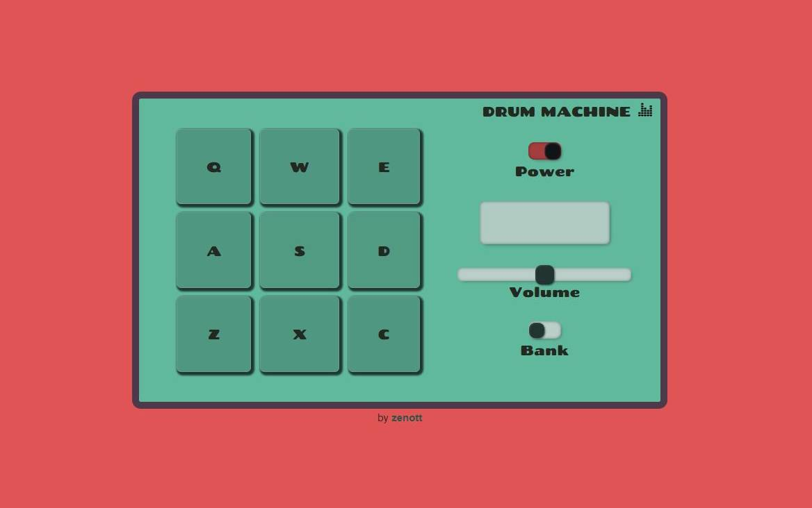

### Drum Machine React App

> Drum machine web application built with React.



## Live Demo

[Demo Link](https://zenott.github.io/drum-machine)

## Built With

- React.js
- HTML5
- CSS3

## Usage

### Prerequisites

- node
- npm

### Getting started

Clone the repository to your local machine

```
$ git clone https://github.com/zenott/drum-machine.git
```

Change into the project directory

```
$ cd drum-machine
```

Install dependencies

```
$ npm install
```

Start development server

```
$ npm run start
```

### Run the test suite

```
$ npm run test
```

## Author

👤 **Balint Mendli**

- Github: [@zenott](https://github.com/zenott)
- Website: [mendli.com](https://mendli.com)
- Email: [balint@mendli.com](mailto:balint@mendli.com)

## 🤝 Contributing

Contributions, issues and feature requests are welcome!
Feel free to check [issues page](https://github.com/zenott/drum-machine/issues/).

1. Fork it
2. Create your working branch

```
git checkout -b my-new-feature
```

3. Commit your changes

```
git commit -am 'Add some feature'
```

4. Push to the branch

```
git push origin my-new-feature
```

5. Create a new Pull Request

## Show your support

Give a ⭐️ if you like this project!

## 📝 License

This project is [MIT](LICENSE.md) licensed.
